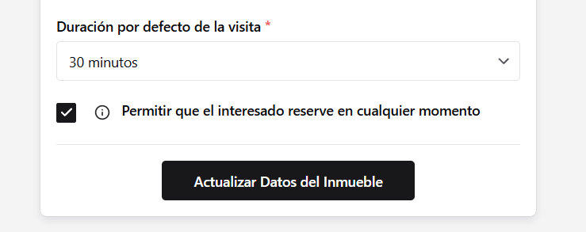
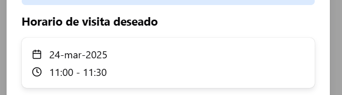

### Reservas en cualquier momento

#### Reservas en cualquier momento

Anteriormente para que un interesado pudiese reservar una cita en un inmueble había que crear previamente un horario de reserva para el mismo.

Ahora esto no es necesario y un inmueble se puede marcar como habilitado para que el interesado sugiera una fecha y hora de reserva caulesquiera:

Este dato se mostrará en las peticiones de visita de inmuebles con esta opción. Si se aprueban, la visita se agendará automáticamente a esa hora:

### Otros

- Las imágenes de los inmuebles ahora se pueden subir de forma más rápida
- Los distintos selectores de agentes en la interfaz ahora son más rápidos

<!-- ### Mejoras

- Mejoras internas que nos permitirán lanzar nuevas versiones de AutoVisita de manera más efectiva -->

### Arreglos

- Arreglados los problemas que prevenían que ciertos interesados no tuviesen marcada la aceptación de política de datos
- Arreglado el problema que no asignaba un contacto principal a ciertos interesados

<!-- _No ha habido que arreglar nada_ -->
