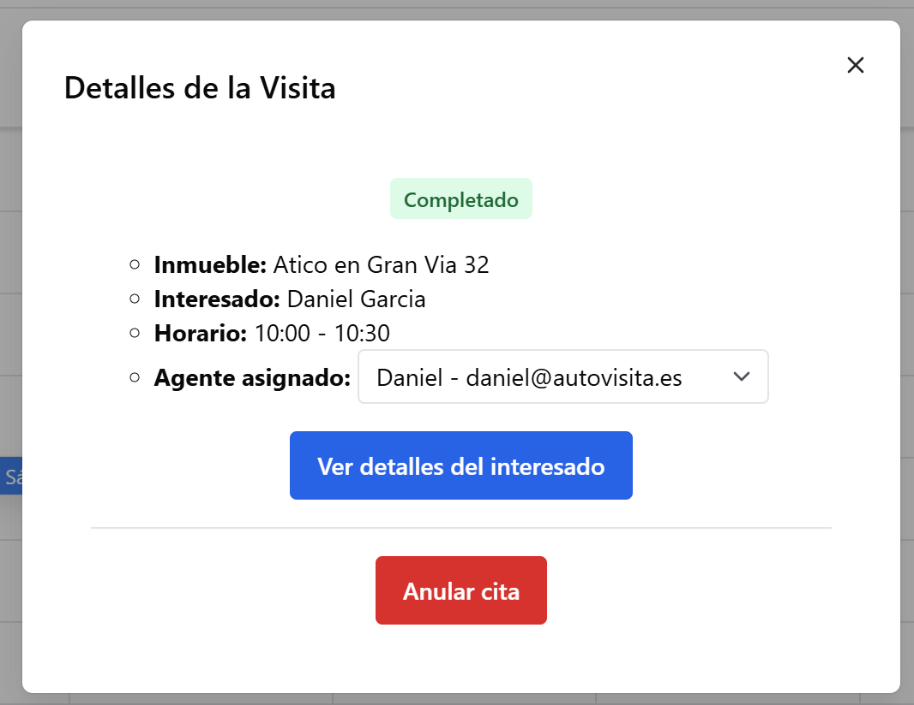

### Visitas divididas entre agentes

Las visitas ahora son asignadas a cada agente automáticamente (si son los que aprueban la solicitud) o manualmente desde un desplegable:

En el calendario, se podrá seleccionar el agente que se quiera para ver su agenda.

### Arreglos

- Arreglado un error que provocaba que ciertas visitas estuviesen en otra zona horaria diferente a la de la agencia
