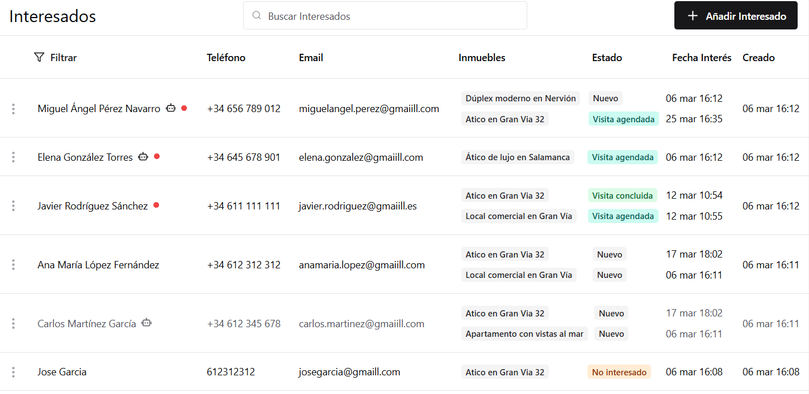

### Nueva vista de interesados!

Hemos añadido varias mejoras que permiten un mejor filtrado de los interesados:

- Los interesados que AutoVisita gestiona automáticamente desde Idealista ahora se marcan con un icono de un robot
- Los interesados nuevos, que todavía no han sido vistos, aparecen con un punto rojo
- Ahora se puede ver el estado y la fecha de interés de cada inmueble de un interesado

Todas estas mejoras hacen que, de un vistazo, se pueda coordinar mejor el cribado y el seguimiento de interesados
