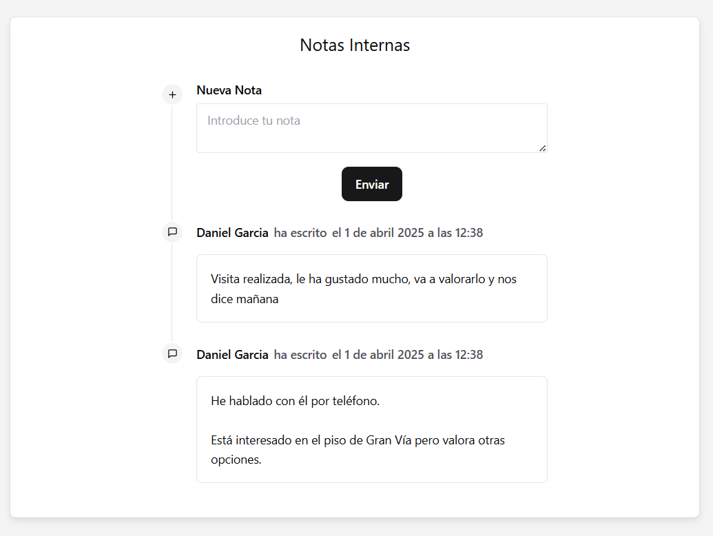
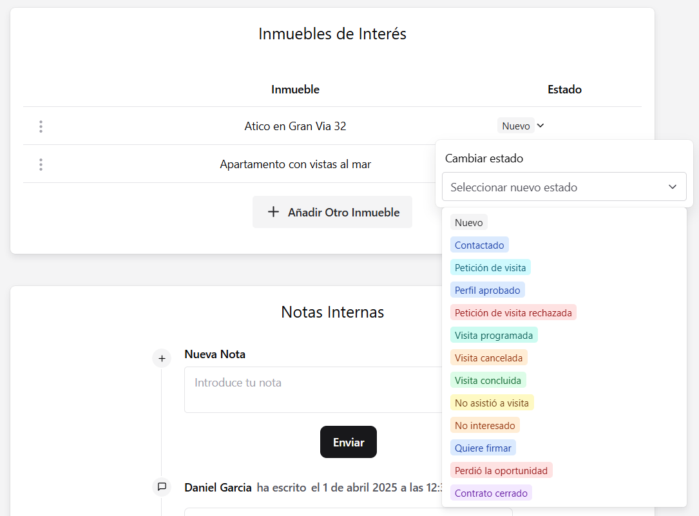
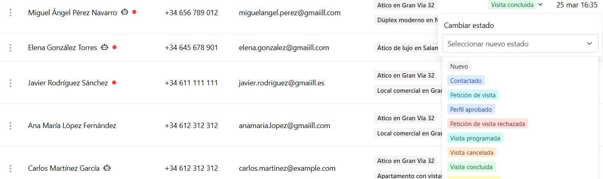

### Notas internas y nuevos estados!

#### Notas Internas

Ahora se pueden crear una serie de notas internas en cada interesado:

Estas notas funcionan como un chat de grupo entre los agentes inmobiliarios, por lo que la comunicación resulta mucho más fluida.

Las notas también se podrán ver en las peticiones de visita.

#### Nuevos estados

Ahora los estados se pueden cambiar manualmente! Hemos creado una amplia lista de estados que permiten llevar un mejor control de todos los interesados.

Estos estados también están disponibles en la vista general de Interesados, por lo que con un simple clic se puede actualizar el estado de un interesado con respecto al inmueble:

### Mejoras

Hemos mejorado la funcionalidad de AutoVisita con las siguientes mejoras:

- Al aceptar una petición de visita con una hora sugerida, AutoVisita comprobará si existe alguna otra visita que coincida con esta y avisará al usuario en dicho caso.
